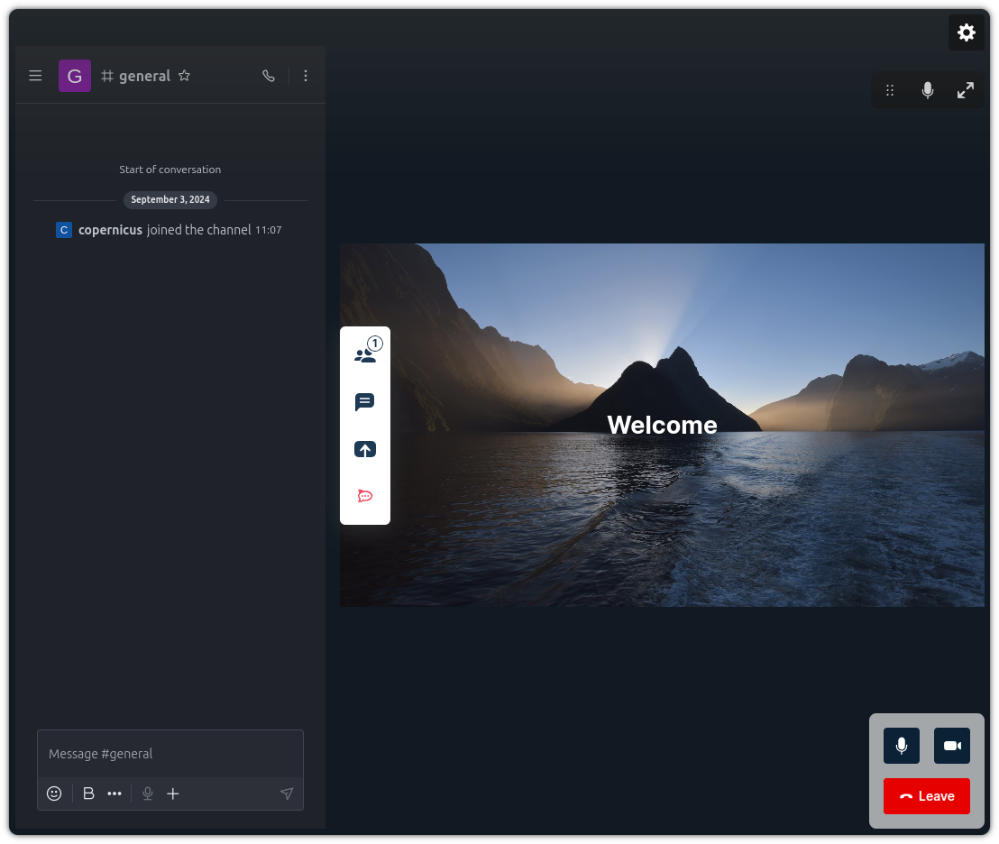

# Web App 3 Plugin: Rocket.Chat

This plugin allows you to integrate Rocket.Chat with Pexip Infinity. You can
define the Rocket.Chat channel to be used in the conference URL. The plugin will
open the Rocket.Chat channel in a new section inside the conference in the Web
App 3.



## Configure Pexip Infinity and Rocket.Chat

To use this plugin, you need to configure Pexip Infinity and Rocket.Chat. You
can get more information about how to configure both in the
[Pexip Docs Portal](https://docs.pexip.com/admin/rocket_chat_intro.htm#persistent).

## Run for development

Once the branding for development is deployed we need to configure some
parameters:

- Edit `vite.json` with your environment parameters. You only have to modify the
  `infinityUrl` parameter with the URL of your Infinity deployment:

```json
{
  "infinityUrl": "https://192.168.1.101",
  ...
}
```

- Install all the dependencies:

```bash
$ npm i
```

- Run the dev environment:

```bash
$ npm start
```

The plugin will be served from https://localhost:5173, but you should access it
thought the Web App 3 URL. You have more information about how to configure your
environment in the
[Developer Portal: Setup guide for plugin developers](https://developer.pexip.com/docs/plugins/webapp-3/setup-guide-for-plugin-developers).

## Build for production

To create a package, you will need to first install all the dependencies:

```bash
$ npm i
```

And now to create the package itself:

```bash
$ npm run build
```

Congrats! Your package is ready and it will be available in the `dist` folder.
The next step is to create a Web App3 branding and copy `dist` into that
branding.

If you want to know more about how to deploy your plugin in Pexip Infinity,
check our [Developer Portal](https://developer.pexip.com).
